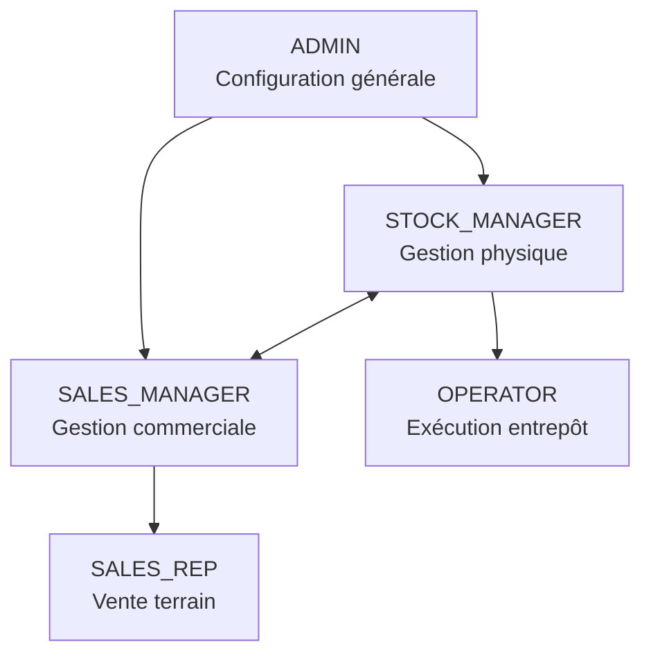

# 🔐 Description Complète des Rôles

## 1. ADMIN (Administrateur)

**Niveau d'accès :** ⭐⭐⭐⭐⭐ (Maximum)

**Responsabilités :**

- 👥 **Gestion des utilisateurs** : Création, modification, suppression des comptes et attribution des rôles
- ⚙️ **Configuration système** : Paramètres globaux, catégories, types de produits
- 🏢 **Gestion des entreprises** : Configuration des entités Entreprise
- 📊 **Audit complet** : Accès à tous les rapports et données du système
- 🔧 **Maintenance** : Sauvegarde, restauration, paramètres techniques
- 🔒 **Sécurité** : Gestion des permissions et politiques de sécurité

## 2. STOCK_MANAGER (Gestionnaire de Stock)

**Niveau d'accès :** ⭐⭐⭐⭐ (Élevé)

**Responsabilités :**

- 📦 **Gestion des articles** : Création, modification, suppression des Article
- 📥 **Réception marchandises** : Validation des livraisons fournisseurs
- 📤 **Expédition** : Préparation et validation des sorties de stock
- 🔄 **Mouvements de stock** : Gestion complète des MvtStk (entrées/sorties)
- 📋 **Inventaires** : Réalisation et ajustement des inventaires physiques
- ⚠️ **Alertes stock** : Surveillance des seuils critiques et ruptures
- 📈 **Rapports stock** : Rotation, valorisation, mouvements

## 3. SALES_MANAGER (Responsable Commercial)

**Niveau d'accès :** ⭐⭐⭐⭐ (Élevé)

**Responsabilités :**

- 🛒 **Gestion des ventes** : Création/modification des CommandeClient et LigneVente
- 👥 **Gestion clients** : CRUD complet sur les fiches Client
- 🏭 **Gestion fournisseurs** : CRUD complet sur les fiches Fournisseur
- 📋 **Commandes fournisseurs** : Création des CommandeFournisseur et LigneCommandeFournisseur
- 💰 **Tarification** : Gestion des prix de vente et conditions commerciales
- 📊 **Rapports commerciaux** : CA, marges, performance clients/fournisseurs
- 💳 **Conditions paiement** : Gestion des termes commerciaux

## 4. OPERATOR (Opérateur d'Entrepôt)

**Niveau d'accès :** ⭐⭐ (Limité)

**Responsabilités :**

- 📥 **Réception simple** : Saisie des réceptions selon bons de commande
- 📦 **Préparation commandes** : Collecte et emballage des articles
- 📤 **Expédition simple** : Confirmation des sorties de stock
- 🔄 **Transferts internes** : Déplacement entre emplacements
- 👀 **Consultation stock** : Vérification des quantités disponibles
- 📊 **Inventaire physique** : Comptage et saisie des quantités
- 🚨 **Signalement anomalies** : Produits endommagés, erreurs d'emplacement

**Limitations :**

- ❌ Pas de création/suppression d'articles
- ❌ Pas de modification des prix
- ❌ Pas d'accès aux rapports financiers

## 5. SALES_REP (Commercial/Vendeur)

**Niveau d'accès :** ⭐⭐ (Limité)

**Responsabilités :**

- 👀 **Consultation stocks** : Vérification disponibilité pour les clients
- 🛒 **Création commandes clients** : Saisie des CommandeClient simples
- 📋 **Suivi commandes** : État d'avancement des commandes en cours
- 👥 **Consultation clients** : Accès aux informations clients existants
- 💰 **Devis/Propositions** : Création de propositions commerciales
- 📞 **Support client** : Réponse aux demandes de disponibilité

**Limitations :**

- ❌ Pas de modification des prix (sauf remises autorisées)
- ❌ Pas de gestion des fournisseurs
- ❌ Pas d'accès aux coûts d'achat
- ❌ Rapports limités aux ventes personnelles

# 🔐 Roles Hierarchy

